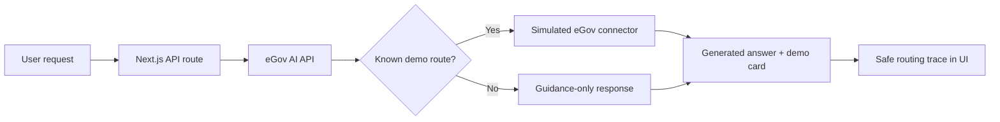

# eGov Agent

This application is a hybrid proof of concept:

- Citizen authentication uses the official eGovPH login widget and the real
  eGov SSO sandbox token/profile exchange. Partner credentials stay on the
  server and the local app session is stored in an encrypted HTTP-only cookie.
- The AI understanding, government-service routing, response, and safe reasoning
  summary come directly from the official eGov AI API.
- DBM budget queries use the live Compass API. Flooding reports validate their
  category and PSGC location through eReport, then submit only after explicit
  review. NBI and LTO demo payments create hosted eGovPay test checkouts and
  read the provider status back before showing any result. Other agency
  records, bookings, and document cards remain simulated demo connectors.
- Arbitrary English, Filipino, and Taglish requests are supported. Services
  without a demo connector still receive live AI guidance and an agency route,
  but no fake record or transaction card.

## Run the POC

1. Generate an eGov AI hackathon credential in the
   [official eGov AI catalog](https://platforms.e.gov.ph/dashboard/api-catalogs/egov-ai).
2. Obtain an eGov SSO sandbox credential from the
   [official developer portal](https://platforms.e.gov.ph/dashboard/api-catalogs/egov-sso).
   Generate a Compass credential from the
   [official Compass catalog](https://platforms.e.gov.ph/dashboard/api-catalogs/compass)
   when testing DBM budget queries. Generate an eReport access code from the
   [official eReport catalog](https://platforms.e.gov.ph/dashboard/api-catalogs/ereport)
   when testing citizen-report submission. For hosted test payments, generate
   a `test_` eGovPay token and settlement template in the
   [official eGovPay catalog](https://platforms.e.gov.ph/dashboard/api-catalogs/egovpay).
3. Copy `.env.example` to `.env.local`, set `EGOV_AI_BASE_URL` and
   `EGOV_AI_ACCESS_CODE`, and fill the `EGOV_SSO_*` values. Generate
   `EGOV_SESSION_SECRET` with at least 32 random characters.
4. Install dependencies and run the app:

```bash
npm install
npm run dev
```

The eGov AI gateway configuration is:

```dotenv
EGOV_AI_BASE_URL=https://platforms-api.e.gov.ph/egov-ai
EGOV_AI_ACCESS_CODE=replace-with-your-egov-ai-access-code
COMPASS_BASE_URL=https://platforms-api.e.gov.ph/compass
COMPASS_API_KEY=replace-with-your-compass-token
EREPORT_BASE_URL=https://platforms-api.e.gov.ph/ereport
EREPORT_ACCESS_CODE=replace-with-your-ereport-access-code
EMESSAGE_BASE_URL=https://platforms-api.e.gov.ph/emessage
EMESSAGE_AUTH_TOKEN=replace-with-your-emessage-token
EGOVPAY_BASE_URL=https://platforms-api.e.gov.ph/egovpay
EGOVPAY_MERCHANT_TOKEN=replace-with-your-portal-issued-token
EGOVPAY_SETTLEMENT_TEMPLATE_UUID=replace-with-template-uuid
```

Paste the 32-character Token exactly as shown in the portal. The server adds
the required `test_` prefix before signing and sending sandbox requests.

Add `EGOV_AI_ACCESS_CODE` as a secret environment variable in the Vercel
project before deployment. The app exchanges it for a short-lived bearer token
on the server and never exposes either credential to the browser. Keep the
Compass token and eReport access code server-side for the same reason. eReport
exchanges the access code for a short-lived bearer token and never exposes it
to browser code. The eMessage token stays server-side; custom E.164 recipients
and message bodies require a reviewed draft and an explicit send action. The
demo limits each recipient to three attempts per ten minutes, and an accepted
request is not reported as handset delivery. eGovPay HMAC digests are generated
exclusively on the server. Use only the credential issued for the hackathon
environment and verify the environment shown by eGovPay before completing a
checkout.

Custom eMessage example:

```text
Send an eMessage to +639171234567 saying "Your appointment is confirmed."
```

The app creates a ten-minute, single-use draft and sends only after the user
selects the confirmation action.

Open [http://localhost:3000](http://localhost:3000), choose **Continue with
eGovPH**, and sign in with one of the official sandbox identities shown by the
widget. The widget obtains a single-use exchange code; the backend redeems it
at `/api/token`, fetches the consented citizen profile from
`/api/partner/sso_authentication`, and then establishes the local session.

For the eGovPH in-app redirect mode, register this HTTPS callback with the
platform team:

```text
https://your-domain.example/api/auth/egov/callback
```

During the hackathon, `EGOV_SSO_DEMO_MODE=true` exposes only the official
sandbox test identities in the widget. Set it to `false` before a production
handoff.

## How the hybrid flow works



The AI request stays on the server side. The browser calls `/api/agent`, so it
never receives Gateway credentials. The UI keeps the original eGov Agent
appearance and shows the routing decision inside the existing expandable
reasoning trace. It does not expose the model name or private chain-of-thought.

## Telegram channel

The web chat and Telegram bot use the same headless service in
`lib/agent/headless.ts`. Telegram only translates incoming updates into agent
requests and converts structured cards into native chat text and quick-action
buttons.

Add these values to `.env.local`:

```dotenv
TELEGRAM_BOT_TOKEN=replace-with-botfather-token
TELEGRAM_WEBHOOK_SECRET_TOKEN=replace-with-a-random-secret
TELEGRAM_BOT_USERNAME=eGovAgentBot
APP_BASE_URL=http://localhost:3000
```

For a local demo, keep the Next.js server running and start the polling bridge
in a second terminal:

```bash
npm run telegram:dev
```

The polling bridge forwards Telegram updates to
`/api/webhooks/telegram`. It removes any existing Telegram webhook while it is
running because polling and webhooks cannot be active at the same time.

For production, deploy the app on a public HTTPS origin and configure Telegram
to send updates directly to:

```text
https://your-domain.example/api/webhooks/telegram
```

Set the same `TELEGRAM_WEBHOOK_SECRET_TOKEN` as Telegram’s `secret_token`.
The route validates Telegram’s secret header before processing an update.
Conversation state is currently kept in bounded process memory for the demo;
replace it with the production memory store when scaling to multiple instances.

## Checks

```bash
npm run build
npx eslint app/api/agent/route.ts app/api/webhooks/telegram/route.ts \
  lib/agent/headless.ts lib/telegram/bot.ts lib/ai/egov-router.ts \
  app/agent/ai-contract.ts app/agent/brain.ts
```
