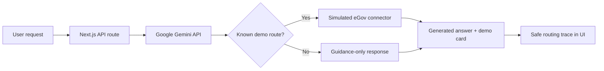

# eGov Agent

This application is a hybrid proof of concept:

- Citizen authentication uses the official eGovPH login widget and the real
  eGov SSO sandbox token/profile exchange. Partner credentials stay on the
  server and the local app session is stored in an encrypted HTTP-only cookie.
- The AI understanding, government-service routing, response, and safe reasoning
  summary come directly from the Google Gemini API through the Vercel AI SDK.
- Government agency records, payments, bookings, and document cards remain
  simulated demo connectors.
- Arbitrary English, Filipino, and Taglish requests are supported. Services
  without a demo connector still receive live AI guidance and an agency route,
  but no fake record or transaction card.

## Run the POC

1. Create a Gemini API key in Google AI Studio.
2. Obtain an eGov SSO sandbox credential from the
   [official developer portal](https://platforms.e.gov.ph/dashboard/api-catalogs/egov-sso).
3. Copy `.env.example` to `.env.local`, set `GEMINI_API_KEY`, and fill the
   `EGOV_SSO_*` values. Generate `EGOV_SESSION_SECRET` with at least 32 random
   characters.
4. Install dependencies and run the app:

```bash
npm install
npm run dev
```

The default model and reasoning level are:

```dotenv
GEMINI_API_KEY=replace-with-your-gemini-api-key
AI_MODEL=gemini-3.6-flash
AI_REASONING_EFFORT=low
```

Add the same `GEMINI_API_KEY` as a secret environment variable in the Vercel
project before deployment. `GOOGLE_GENERATIVE_AI_API_KEY` is also supported as
an alternative name. The `AI_MODEL` value remains configurable so the
application can switch Gemini models without changing the agent code.

Open [http://localhost:3000](http://localhost:3000), choose **Continue with
eGovPH**, and sign in with one of the official sandbox identities shown by the
widget. The widget obtains a single-use exchange code; the backend redeems it
at `/api/token`, fetches the consented citizen profile from
`/api/partner/sso_authentication`, and then establishes the local session.

For the eGovPH in-app redirect mode, register this HTTPS callback with the
platform team:

```text
https://your-domain.example/api/auth/egov/callback
```

During the hackathon, `EGOV_SSO_DEMO_MODE=true` exposes only the official
sandbox test identities in the widget. Set it to `false` before a production
handoff.

## How the hybrid flow works



The AI request stays on the server side. The browser calls `/api/agent`, so it
never receives Gateway credentials. The UI keeps the original eGov Agent
appearance and shows the routing decision inside the existing expandable
reasoning trace. It does not expose the model name or private chain-of-thought.

## Telegram channel

The web chat and Telegram bot use the same headless service in
`lib/agent/headless.ts`. Telegram only translates incoming updates into agent
requests and converts structured cards into native chat text and quick-action
buttons.

Add these values to `.env.local`:

```dotenv
TELEGRAM_BOT_TOKEN=replace-with-botfather-token
TELEGRAM_WEBHOOK_SECRET_TOKEN=replace-with-a-random-secret
TELEGRAM_BOT_USERNAME=eGovAgentBot
APP_BASE_URL=http://localhost:3000
```

For a local demo, keep the Next.js server running and start the polling bridge
in a second terminal:

```bash
npm run telegram:dev
```

The polling bridge forwards Telegram updates to
`/api/webhooks/telegram`. It removes any existing Telegram webhook while it is
running because polling and webhooks cannot be active at the same time.

For production, deploy the app on a public HTTPS origin and configure Telegram
to send updates directly to:

```text
https://your-domain.example/api/webhooks/telegram
```

Set the same `TELEGRAM_WEBHOOK_SECRET_TOKEN` as Telegram’s `secret_token`.
The route validates Telegram’s secret header before processing an update.
Conversation state is currently kept in bounded process memory for the demo;
replace it with the production memory store when scaling to multiple instances.

## Checks

```bash
npm run build
npx eslint app/api/agent/route.ts app/api/webhooks/telegram/route.ts \
  lib/agent/headless.ts lib/telegram/bot.ts lib/ai/egov-router.ts \
  app/agent/ai-contract.ts app/agent/brain.ts
```
