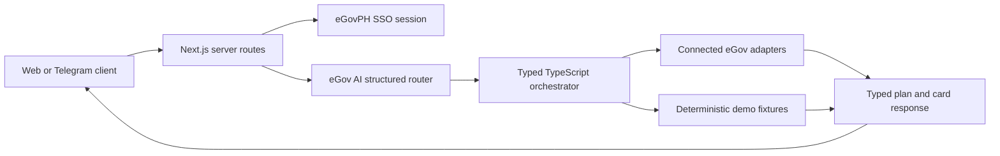

# eGov Agent

An open-source hackathon prototype for completing Philippine government-service journeys through one conversational interface.

**Developed by [Bryl Lim](https://bryllim.com) for the eGov Hackathon 2026.**

> [!IMPORTANT]
> This repository is an independent hackathon project. It is not an official government service and is not a production deployment. Government names, marks, and logos belong to their respective owners.

## What is connected

The app combines live eGov sandbox integrations with clearly bounded demo fixtures.

| Service | Repository status | What the integration does |
| --- | --- | --- |
| eGovPH SSO | Connected | Exchanges the one-time code and retrieves the consented sandbox profile on the server. |
| eGov AI | Connected | Interprets English, Filipino, and Taglish requests and returns a structured route and response draft. |
| DBM Compass | Connected | Reads SAAODB, NCA, SARO, and LGSF budget data for interactive charts. |
| eReport | Connected | Loads report and location datasets, prepares a review, and submits after explicit confirmation. |
| eGovPay | Connected | Creates hosted sandbox checkouts and reads transaction status back from the provider. |
| eMessage | Connected | Previews a custom SMS, validates an E.164 number, and sends only after explicit confirmation. |
| Telegram | Optional channel | Uses the same headless agent through polling in development or a signed webhook in deployment. |
| Viber | UI demonstration | Shows how the agent can look in Viber; no live Viber Business Messages API is connected. |
| Other agency journeys | Demo fixtures | Render deterministic sample records, forms, bookings, and documents. They do not call agency systems of record. |

eVerify, Face Liveness, eGovChain, eGovDX, and direct agency/LGU systems are not integrated in this repository. Their presence in a reference architecture or a demo card is not evidence of a live connection.

## Product highlights

- One responsive chat experience for government-service discovery and transactions.
- Typed React cards for records, forms, maps, charts, reports, checkout links, and status results.
- Review-before-submit gates for reports, payments, Vault reuse, and SMS delivery.
- Server-only API credentials, bounded inputs, request timeouts, and normalized provider errors.
- A shared headless agent contract for the web app and Telegram adapter.
- Light-mode citizen interface with mobile-first conversation controls.

## Architecture



The model interprets requests but does not receive authority to call arbitrary tools or render arbitrary HTML. The server selects from allowlisted service adapters and the client renders a discriminated card contract.

Read [docs/ARCHITECTURE.md](docs/ARCHITECTURE.md) for trust boundaries, current persistence behavior, and production gaps.

## Local setup

### Requirements

- Node.js 20.9 or newer
- npm 10 or newer
- Approved sandbox credentials from the [eGov API Developer Portal](https://platforms.e.gov.ph/)

### Install

```bash
git clone https://github.com/bryllim/egov-agent.git
cd egov-agent
npm install
cp .env.example .env.local
```

Generate a local session secret:

```bash
openssl rand -base64 32
```

Add it to `EGOV_SESSION_SECRET` in `.env.local`, then fill only the credentials for the services you intend to test. `.env.local` is ignored by Git.

Start the development server:

```bash
npm run dev
```

Open [http://localhost:3000](http://localhost:3000).

### eGov sandbox credentials

Use the official catalog to generate service- and environment-scoped credentials:

- [eGovPH SSO](https://platforms.e.gov.ph/dashboard/api-catalogs/egov-sso)
- [eGov AI](https://platforms.e.gov.ph/dashboard/api-catalogs/egov-ai)
- [DBM Compass](https://platforms.e.gov.ph/dashboard/api-catalogs/compass)
- [eReport](https://platforms.e.gov.ph/dashboard/api-catalogs/ereport)
- [eGovPay](https://platforms.e.gov.ph/dashboard/api-catalogs/egovpay)
- [eMessage](https://platforms.e.gov.ph/dashboard/api-catalogs/emessage)

The complete variable list and safe placeholders live in [.env.example](.env.example). Never commit `.env.local`, portal screenshots containing credentials, bearer tokens, callback payloads, or real citizen data.

For the eGovPH redirect flow, register this callback with the platform team:

```text
https://your-domain.example/api/auth/egov/callback
```

Use `http://localhost:3000/api/auth/egov/callback` only for local development when the sandbox permits it.

## Telegram development channel

Configure `TELEGRAM_BOT_TOKEN`, `TELEGRAM_WEBHOOK_SECRET_TOKEN`, and `APP_BASE_URL` in `.env.local`. With the Next.js app running, start the polling bridge in another terminal:

```bash
npm run telegram:dev
```

Polling removes an existing Telegram webhook because Telegram does not allow polling and webhook delivery at the same time. For deployment, configure Telegram to send updates to:

```text
https://your-domain.example/api/webhooks/telegram
```

The route verifies Telegram's secret-token header before processing an update.

## Demo data and persistence

All bundled identities, records, phone numbers, documents, reference numbers, balances, dates, and transactions are synthetic hackathon fixtures unless a connected sandbox API returns them.

The current persistence model is intentionally limited:

- The eGovPH profile is stored in an encrypted, authenticated, HttpOnly cookie for up to eight hours.
- Personal Memory is a static fixture in `app/agent/personal-context.ts`.
- Conversation state is held in the active browser session.
- Audit events are redacted and stored in browser `localStorage`; they are not append-only server audit records.
- Vault files under `public/vault/` are demo assets. Newly selected uploads are not persisted by a backend object store.
- Telegram conversations, eMessage drafts, and demo rate limits use bounded process memory and reset when the process restarts.

Do not use this storage model for production or real citizen information.

## Quality checks

```bash
npm run lint
npm run typecheck
npm run build
npm audit --omit=dev
```

CI runs the same lint, type, build, and production-dependency audit checks on pushes and pull requests.

## Repository structure

```text
app/                 Next.js pages and server routes
components/          Shared interface components
lib/agent/           Headless orchestration
lib/ai/              eGov AI client and structured routing
lib/{compass,...}/   Server-only eGov service clients
public/              Static branding and synthetic demo fixtures
scripts/             Local fixture and Telegram utilities
docs/                Architecture and project documentation
```

## Security and responsible use

- Use sandbox credentials and synthetic identities only.
- Keep all service credentials on the server.
- Require an explicit user action before submitting a report, opening a checkout, or sending an SMS.
- Treat redirects and callbacks as untrusted. Payment completion must come from an authoritative status lookup.
- Do not present demo fixture output as an official government record or completed transaction.

Report suspected vulnerabilities through the process in [SECURITY.md](SECURITY.md). Please do not include credentials, personal information, or live citizen records in a public issue.

## Contributing

Contributions are welcome. Read [CONTRIBUTING.md](CONTRIBUTING.md) before opening a pull request.

## License

Released under the [MIT License](LICENSE). The license applies to this project's original source code, not to third-party government names, marks, logos, API services, or documentation. See [THIRD_PARTY_NOTICES.md](THIRD_PARTY_NOTICES.md).
